<h1 align="center">Ứng dụng Quản lý cửa hàng nông sản</h1>

## 🌟 Giới thiệu

- **📍 Đăng nhập, đăng ký với nhiều vai trò:** Bạn có thể đăng nhập với 4 vai trò: Quản trị viên, người bán, người mua, nhà vận chuyển
- **💡 Mua hàng và thanh toán:** Giả lập mua hàng và thanh toán giữa người mua, người bán
- **🏙️ Quản lý cửa hàng với vai trò admin:** Bạn có thể thêm, sửa, xóa người dùng cùng với quản lý danh mục nông sản và xem các sản phẩm và các giao dịch trên ứng dụng 
- **🔍 Chat giữa người mua và người bán:** Chức năng chat cho phép khách hàng và người bán giao tiếp với nhau
---
## 🛠️ CÔNG NGHỆ SỬ DỤNG

### 🖥️ Phần mềm

## 🚀 Hướng dẫn cài đặt và chạy
1. Cài đặt thư viện Python. 

- Cài đặt Python 3.6 trở lên nếu chưa có, sau đó cài đặt các thư viện cần thiết bằng pip.

2. Cấu hình MongoDB
- Cài đặt MongoDB nếu chưa có.
- Khởi động MongoDB và đảm bảo đang hoạt động tại `mongodb://localhost:27017/`.
- Khôi phục cơ sở dữ liệu từ bản sao lưu:

        mongorestore --db AgricultureDB "đường-dẫn-đến-thư-mục-AgricultureDB"
- Ví dụ:

        mongorestore --db AgricultureDB "C:\Users\LENOVO\Documents\BTL_CNDL\ChuongTrinh\AgricultureDB"
📌 Lưu ý:
-	Tránh trùng lặp cơ sở dữ liệu: Trước khi thực hiện restore, hãy kiểm tra xem MongoDB đã có cơ sở dữ liệu tên AttendanceDB chưa. Nếu có, bạn có thể gặp lỗi hoặc dữ liệu cũ có thể bị ghi đè.
-	Đảm bảo MongoDB đang chạy: Nếu MongoDB chưa được khởi động, lệnh mongorestore sẽ không hoạt động.

## 📱 Giao diện chương trình
### Giao diện đăng ký & đăng nhập ###
1. Giao diện đăng ký

  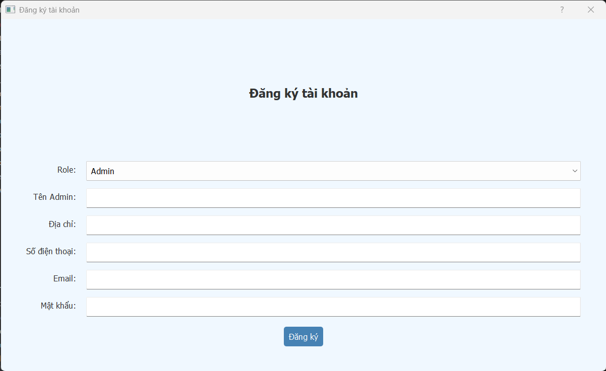

2. Giao diện đăng nhập

  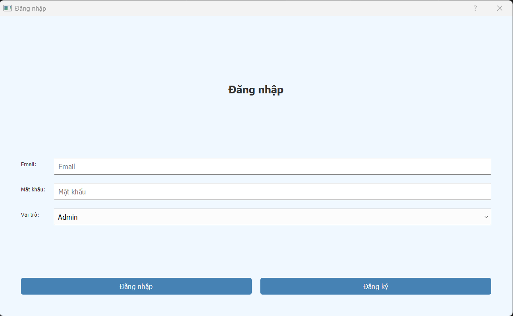

### Giao diện Đăng nhập với vai trò Quản trị viên ###
1. Giao diện trang Quản lý người dùng

  

2. Giao diện trang Quản lý danh mục

  

3. Giao diện trang Quản lý sản phẩm

  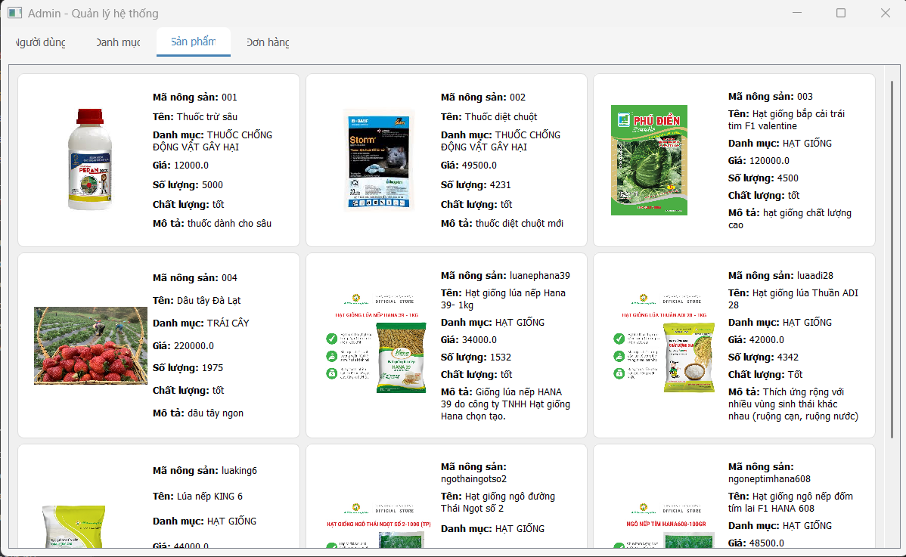

4. Giao diện trang Quản lý đơn hàng

  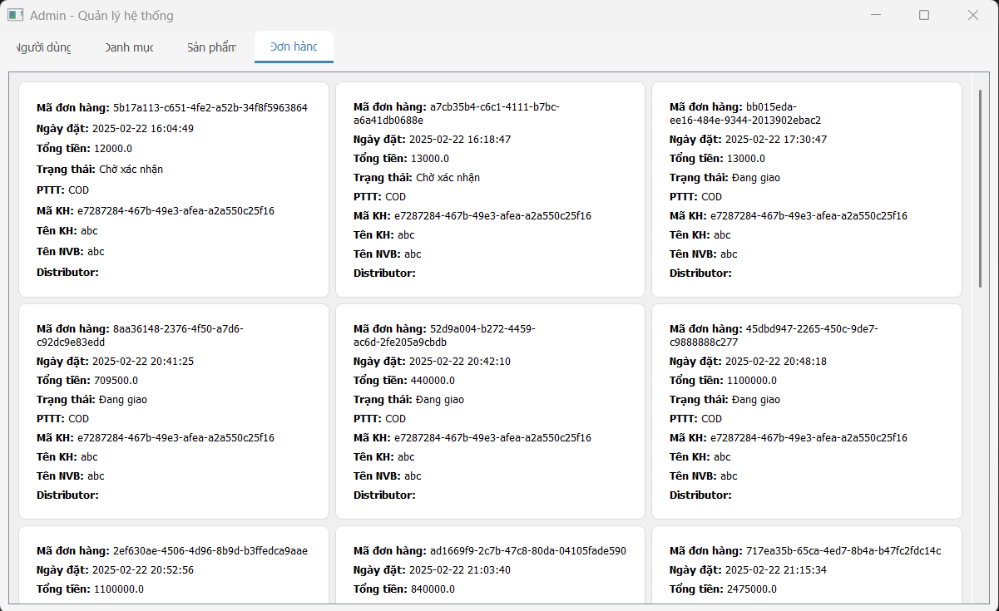

### Giao diện khi đăng nhập với vai trò Người bán ###
1. Giao diện trang quản lý sản phẩm

  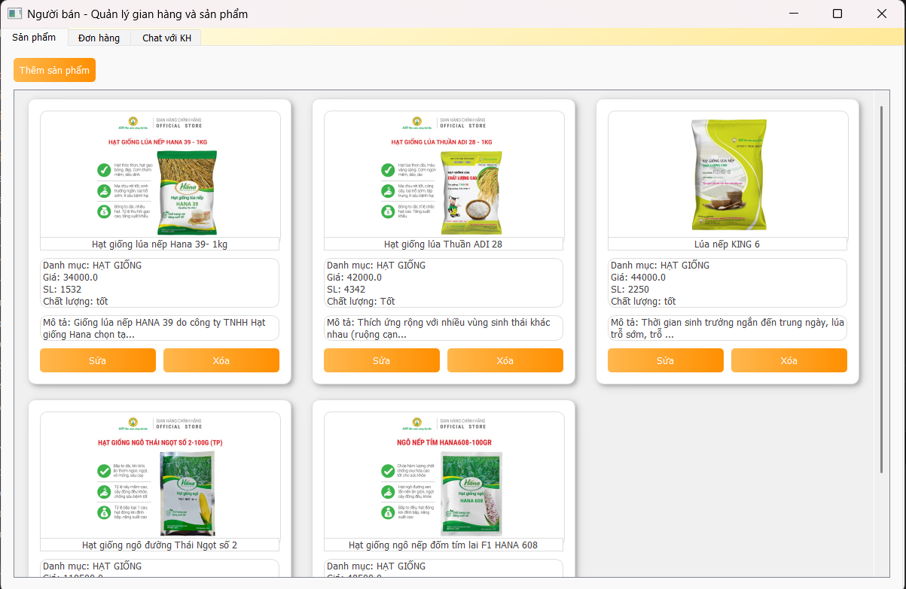

2. Giao diện trang Quản lý đơn hàng

  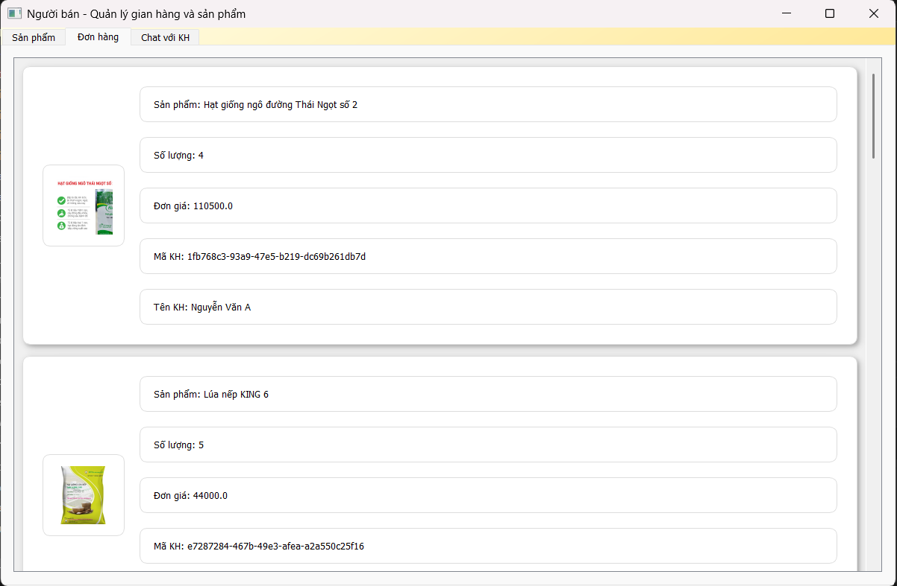

3. Giao diện trang Chat với Khách hàng

  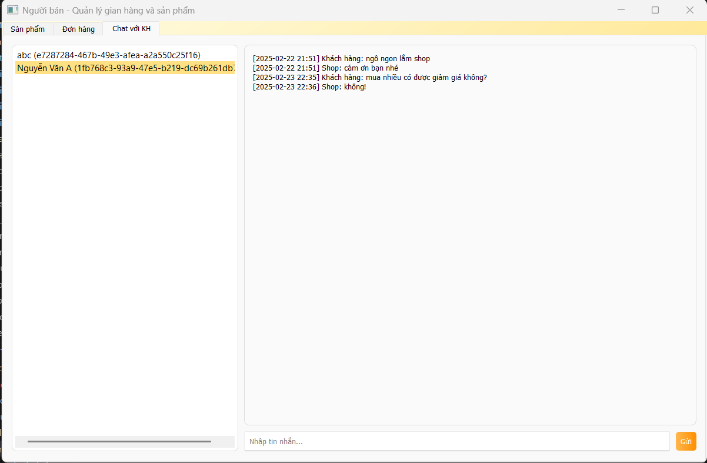

### Giao diện khi đăng nhập với vai trò Khách hàng ###
1. Giao diện trang Duyệt sản phẩm

  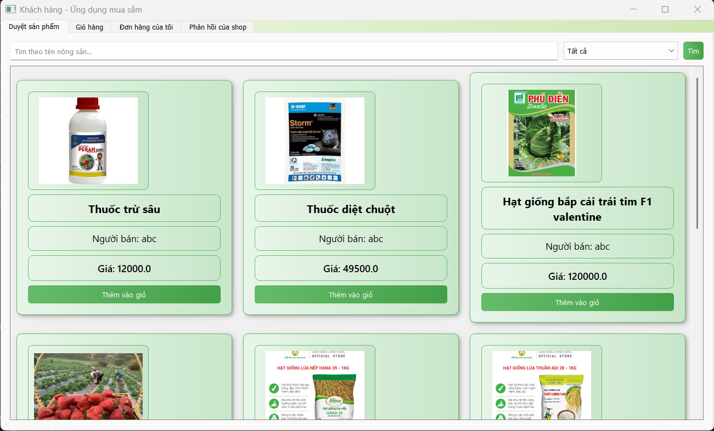

2. Giao diện trang Giỏ hàng

  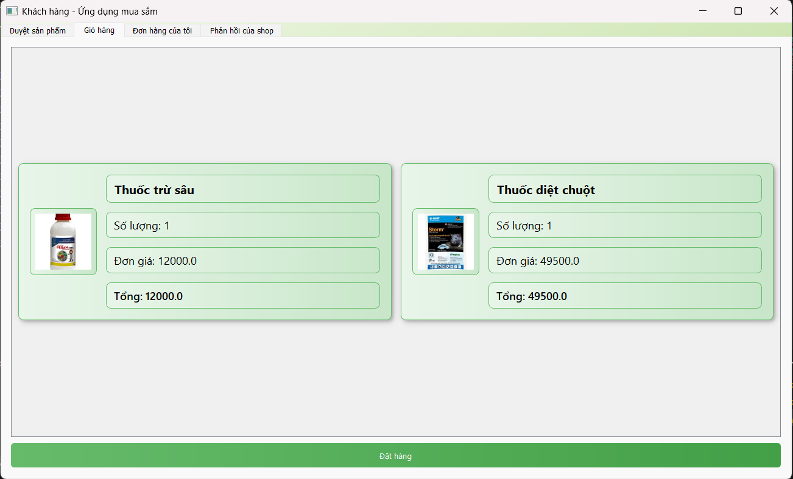

3. Giao diện trang Đơn hàng của tôi

  

4. Giao diện trang Chat với người bán

  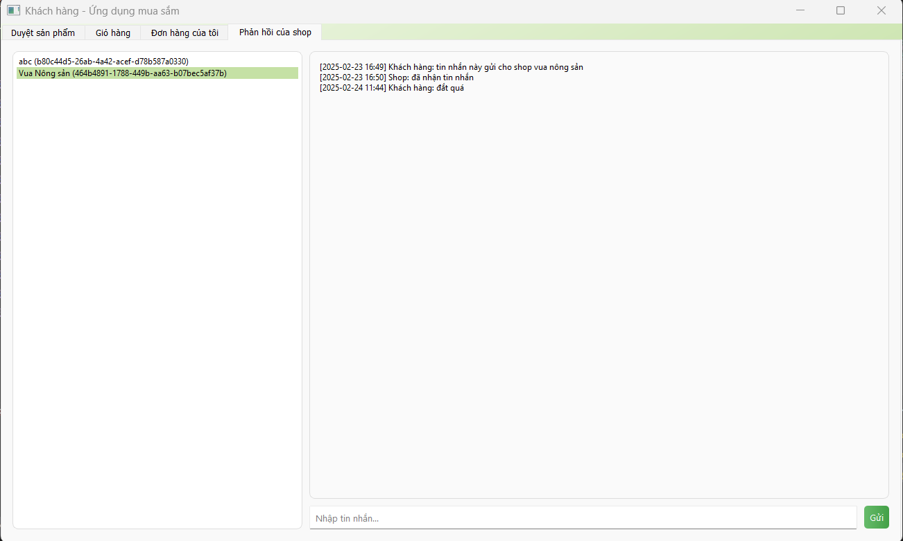

### Giao diện khi đăng nhập với vai trò Nhà Phân phối ###
1. Giao diện chính của Nhà phân phối

  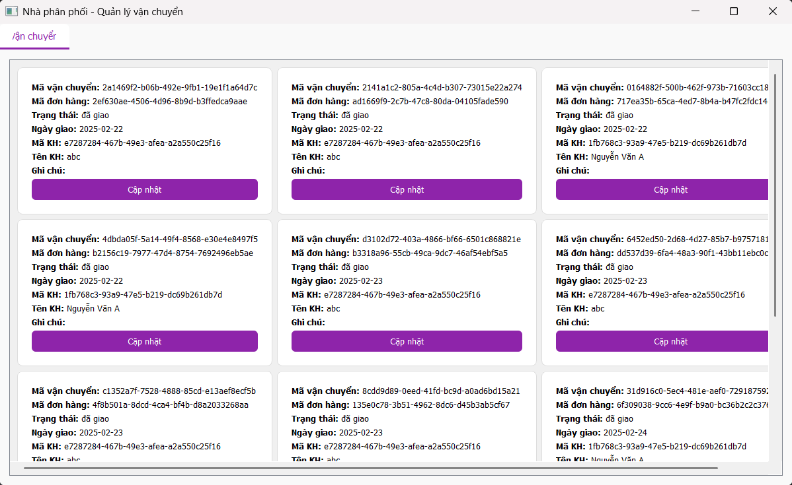

1. Giao diện Cập nhật thông tin đơn hàng

  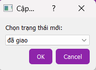

## 🤝 Vai Trò
Dự án được phát triển bởi 1 thành viên:

| Họ và Tên       | Vai trò                  |
|-----------------|--------------------------|
| Nguyễn Nam Hưng | Phát triển mã nguồn, kiểm thử, triển khai dự án|
